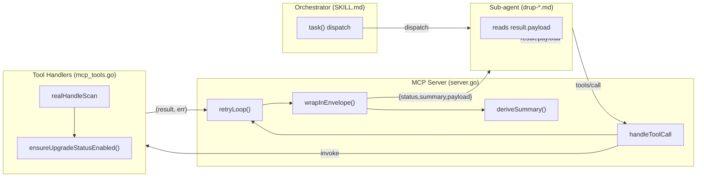

# Design: drup-retrospective-fixes

## Overview & Architecture Diagram

This change addresses two P0 failures and three P1/P2 hardening items from the 2026-08-03 retrospective. The core architectural change is a **uniform response envelope** at the MCP server level (`handleToolCall`), which wraps every tool response — success or failure — in `{"status","summary","payload"}`. This is paired with **selective retry** for transient transport errors, **auto-enable** of `upgrade_status` in `realHandleScan`, a **tool count assertion** test, and **sub-agent template updates** to read from `result.payload`.



**Key flows:**
- **Success**: handler → `(payload, nil)` → retryLoop passes through → `wrapInEnvelope` builds `{status:"pass", summary:deriveSummary(name, payload), payload:payload}` → `sendResult`
- **Transient error**: handler → `(nil, err)` → retryLoop retries up to 2× with 1s exponential backoff → on success, normal envelope; on exhaustion, `{status:"fail", summary:"... after 3 attempts ..."}`
- **Logic error**: handler → `(nil, err)` → retryLoop does NOT retry → `{status:"fail", summary:err.Error()}` → `sendResult` (NOT `sendError`)
- **Protocol error** (malformed JSON, unknown tool): still `sendError` (JSON-RPC error) — these are dispatch failures, not tool failures

---

## REQ-1: `realHandleScan` Auto-Enable — Design

### File & Location

`internal/app/mcp_tools.go`, function `realHandleScan` (lines 152-179).

### Approach

Extract the auto-enable logic from `realHandleUpgradeScan` (lines 824-856) into a shared helper `ensureUpgradeStatusEnabled(projectPath string) error`. Both `realHandleScan` and `realHandleUpgradeScan` call this helper. This avoids duplicating ~30 lines of enable logic.

### Helper: `ensureUpgradeStatusEnabled`

```go
// ensureUpgradeStatusEnabled checks if upgrade_status is enabled and enables it
// if present in composer.json but not enabled. Returns an error if the module
// is not installed or if enabling fails.
func ensureUpgradeStatusEnabled(projectPath string) error {
    detection, err := defaultEnvDetector.Detect(projectPath, false)
    if err != nil {
        return err
    }

    // 1. Check composer.json for upgrade_status.
    composerPath := filepath.Join(projectPath, "composer.json")
    composerData, err := os.ReadFile(composerPath)
    if err != nil {
        return fmt.Errorf("read composer.json: %w", err)
    }
    var composerJSON map[string]interface{}
    if err := json.Unmarshal(composerData, &composerJSON); err != nil {
        return fmt.Errorf("parse composer.json: %w", err)
    }
    if !hasPackage(composerJSON, "drupal/upgrade_status") {
        return fmt.Errorf("upgrade_status is not installed; run composer require drupal/upgrade_status first")
    }

    // 2. Check pm:list --status=enabled.
    pmStdout, _, pmExit, _ := drupexec.RunWithEnv(projectPath, detection.CommandPrefix,
        "drush", "pm:list", "--status=enabled", "--format=json", "--root="+projectPath)
    if pmExit == 0 {
        var pmData map[string]interface{}
        if json.Unmarshal([]byte(pmStdout), &pmData) == nil {
            if _, ok := pmData["upgrade_status"]; ok {
                return nil // already enabled
            }
        }
    }

    // 3. Auto-enable sequence: config:delete → drush en → drush cr.
    drupexec.RunWithEnv(projectPath, detection.CommandPrefix,
        "drush", "config:delete", "update.settings", "--root="+projectPath)

    _, enStderr, enExit, enErr := drupexec.RunWithEnv(projectPath, detection.CommandPrefix,
        "drush", "en", "upgrade_status", "-y", "--root="+projectPath)
    if enErr != nil {
        return fmt.Errorf("enable upgrade_status: %w", enErr)
    }
    if enExit != 0 {
        return fmt.Errorf("enable upgrade_status failed (exit %d): %s", enExit, enStderr)
    }

    drupexec.RunWithEnv(projectPath, detection.CommandPrefix,
        "drush", "cr", "--root="+projectPath)
    return nil
}
```

### `realHandleScan` modification

Insert a call to `ensureUpgradeStatusEnabled(params.ProjectPath)` at line 159 (after param parsing, before `cliRun`). If it returns an error, return `(nil, err)` immediately.

### `realHandleUpgradeScan` refactor

Replace lines 801-856 with a call to `ensureUpgradeStatusEnabled(params.ProjectPath)`. Note: `realHandleUpgradeScan` currently also auto-installs via `realHandleComposerRequire` if `upgrade_status` is not in `composer.json`. The shared helper does NOT auto-install (per REQ-1 spec: "SHALL NOT silently install it"). To preserve `realHandleUpgradeScan`'s existing behavior, keep its auto-install block (lines 816-822) and only replace the enable check (lines 824-856) with the helper call.

### Test design

| Test | File | Approach |
|------|------|----------|
| `TestEnsureUpgradeStatusEnabled_AlreadyEnabled` | `mcp_tools_test.go` | Mock `pm:list` to return `{"upgrade_status":{...}}`, assert helper returns nil without calling `drush en` |
| `TestEnsureUpgradeStatusEnabled_AutoEnables` | `mcp_tools_test.go` | Mock `pm:list` to return `{}`, mock `drush en` to succeed, assert `drush cr` is called after |
| `TestEnsureUpgradeStatusEnabled_NotInstalled` | `mcp_tools_test.go` | Create temp dir with `composer.json` lacking `drupal/upgrade_status`, assert error contains "not installed" |
| `TestRealHandleScan_AutoEnablesUpgradeStatus` | `mcp_tools_test.go` | Integration: mock project with `upgrade_status` in composer but not enabled, call `realHandleScan`, assert scan proceeds without "no commands defined" error |

**Lines estimate**: ~45 (helper) + ~35 (refactor `realHandleUpgradeScan`) + ~60 (tests) = ~140

---

## REQ-2: Uniform MCP Envelope — Design

### File & Location

`internal/mcp/server.go`, function `handleToolCall` (lines 408-425).

### Envelope struct

```go
// Envelope wraps every MCP tool response with a uniform status signal.
type Envelope struct {
    Status  string          `json:"status"`            // "pass" | "fail"
    Summary string          `json:"summary"`           // human-readable one-liner
    Payload json.RawMessage `json:"payload,omitempty"` // tool-specific response (only on pass)
}
```

Exported for testability (other packages may need to parse envelopes in integration tests).

### New flow in `handleToolCall`

```go
func (s *Server) handleToolCall(id interface{}, params json.RawMessage) error {
    var p ToolCallParams
    if err := json.Unmarshal(params, &p); err != nil {
        return s.sendError(id, -32602, "Invalid params")  // protocol error — stays JSON-RPC
    }

    handler, ok := s.tools[p.Name]
    if !ok {
        return s.sendError(id, -32601, fmt.Sprintf("Tool not found: %s", p.Name))  // protocol error
    }

    // Retry loop (REQ-3) wraps the handler call.
    result, err := s.retryLoop(p.Name, handler, p.Arguments)

    // Wrap in envelope — ALL tool outcomes go through sendResult.
    envelope := wrapInEnvelope(p.Name, result, err)
    envelopeJSON, marshalErr := json.Marshal(envelope)
    if marshalErr != nil {
        // Envelope marshal failure is a server bug, not a tool failure.
        return s.sendError(id, -32603, fmt.Sprintf("envelope marshal: %v", marshalErr))
    }
    return s.sendResult(id, envelopeJSON)
}
```

### `wrapInEnvelope`

```go
func wrapInEnvelope(toolName string, result json.RawMessage, handlerErr error) Envelope {
    if handlerErr != nil {
        return Envelope{
            Status:  "fail",
            Summary: handlerErr.Error(),
        }
    }
    return Envelope{
        Status:  "pass",
        Summary: deriveSummary(toolName, result),
        Payload: result,
    }
}
```

### `deriveSummary`

```go
func deriveSummary(toolName string, payload json.RawMessage) string {
    // Best-effort extraction of common fields.
    var fields map[string]interface{}
    if err := json.Unmarshal(payload, &fields); err != nil {
        return fmt.Sprintf("Tool %s completed", toolName)
    }

    // Check for total_errors (scan-like tools).
    if te, ok := fields["total_errors"]; ok {
        return fmt.Sprintf("Scan complete: %v errors", te)
    }
    // Check for success boolean (drush_exec, composer_require, etc.).
    if s, ok := fields["success"]; ok {
        if b, ok := s.(bool); ok && b {
            return fmt.Sprintf("Tool %s succeeded", toolName)
        }
        return fmt.Sprintf("Tool %s failed", toolName)
    }
    // Check for summary string (some tools already provide one).
    if sum, ok := fields["summary"]; ok {
        if str, ok := sum.(string); ok {
            return str
        }
    }
    return fmt.Sprintf("Tool %s completed", toolName)
}
```

### JSON-RPC error path

- `sendError` is **kept** for protocol-level errors only: malformed JSON (`-32700`), invalid params (`-32602`), unknown tool (`-32601`), method not found (`-32601`).
- `sendError` is **removed** from the handler error path (line 421). Tool failures become `{status:"fail"}` in the result channel.
- Envelope marshal failure is the only case where a tool-related error still goes through `sendError` — this is a server bug, not a tool failure.

### Test design

| Test | File | Approach |
|------|------|----------|
| `TestHandleToolCall_EnvelopeWrap_Success` | `mcp/server_test.go` (new file) | Register mock handler returning `{"foo":"bar"}`, call `handleToolCall`, parse output, assert `status:"pass"`, `payload.foo:"bar"`, `summary` non-empty |
| `TestHandleToolCall_EnvelopeWrap_Error` | `mcp/server_test.go` | Mock handler returns `(nil, error("test error"))`, assert response has `status:"fail"`, `summary:"test error"`, NO `error` field at JSON-RPC level |
| `TestHandleToolCall_PayloadIntact` | `mcp/server_test.go` | Mock handler returns complex nested JSON (mimic `scan.ScanResult`), assert `envelope.payload` matches original byte-for-byte after round-trip |
| `TestDeriveSummary_TotalErrors` | `mcp/server_test.go` | `deriveSummary("scan", {"total_errors":3})` → contains "3 errors" |
| `TestDeriveSummary_Success` | `mcp/server_test.go` | `deriveSummary("drush_exec", {"success":true})` → contains "succeeded" |
| `TestDeriveSummary_Fallback` | `mcp/server_test.go` | `deriveSummary("unknown_tool", {"custom":"data"})` → "Tool unknown_tool completed" |
| `TestHandleToolCall_ProtocolErrors_StillJSONRPC` | `mcp/server_test.go` | Unknown tool name → JSON-RPC error with code `-32601`; malformed params → `-32602` |

**Lines estimate**: ~80 (server.go: Envelope struct + wrapInEnvelope + deriveSummary + handleToolCall rewrite) + ~100 (server_test.go) = ~180

---

## REQ-3: Selective Retry — Design

### File & Location

`internal/mcp/server.go`, new function `retryLoop` called from `handleToolCall`.

### `isTransientError`

```go
func isTransientError(err error) bool {
    if err == nil {
        return false
    }
    msg := err.Error()
    for _, pattern := range []string{
        "context deadline exceeded",
        "connection refused",
        "i/o timeout",
        "broken pipe",
        "no such host",
    } {
        if strings.Contains(msg, pattern) {
            return true
        }
    }
    return false
}
```

### `retryLoop`

```go
func (s *Server) retryLoop(toolName string, handler ToolHandler, args json.RawMessage) (json.RawMessage, error) {
    const maxAttempts = 3
    const baseDelay = 1 * time.Second

    var lastErr error
    for attempt := 1; attempt <= maxAttempts; attempt++ {
        result, err := handler(args)
        if err == nil {
            return result, nil
        }
        if !isTransientError(err) {
            return nil, err  // non-transient: fail immediately
        }
        lastErr = err
        if attempt < maxAttempts {
            delay := baseDelay * time.Duration(1<<(attempt-1))
            metrics.Default().RecordRetry()
            time.Sleep(delay)
        }
    }
    // All attempts exhausted.
    metrics.Default().RecordRetry() // count the last retry
    return nil, fmt.Errorf("%v (after %d attempts)", lastErr, maxAttempts)
}
```

**Note on metrics**: `RecordRetry()` is called on each retry (not on the initial attempt). For 3 attempts, that's 2 retry recordings. The test asserts `retries == 2` for the exhausted case.

**Note on backoff in tests**: Tests must override the `baseDelay` to avoid 3-second test runs. Approach: make `baseDelay` a package-level variable `var retryBaseDelay = 1 * time.Second` that tests set to `1 * time.Millisecond`.

### Test design

| Test | File | Approach |
|------|------|----------|
| `TestRetryLoop_TransientThenSuccess` | `mcp/server_test.go` | Handler fails with "context deadline exceeded" twice, succeeds on third. Assert `status:"pass"`, `metrics.Default().Snapshot().Retries == 2` |
| `TestRetryLoop_NoRetryOnRealError` | `mcp/server_test.go` | Handler fails with "command not found". Assert `status:"fail"`, handler called exactly once, `Retries == 0` |
| `TestRetryLoop_Exhausted` | `mcp/server_test.go` | Handler fails with "i/o timeout" 3 times. Assert `status:"fail"`, summary contains "after 3 attempts", `Retries == 2` |
| `TestIsTransientError` | `mcp/server_test.go` | Table-driven: "context deadline exceeded" → true, "connection refused" → true, "command not found" → false, "exit status 1" → false, nil → false |

**Lines estimate**: ~50 (retryLoop + isTransientError) + ~80 (tests) = ~130

---

## REQ-4: Tool Count Assertion — Design

### File & Location

- `internal/mcp/server.go`: add `ToolCount() int` method.
- `internal/app/mcp_tools_test.go`: modify `TestWireMCPTools_AllToolsRegistered` (lines 30-45).

### `ToolCount` method

```go
// ToolCount returns the number of registered tool handlers.
func (s *Server) ToolCount() int {
    return len(s.tools)
}
```

### Test modification

Replace lines 35-44 with:

```go
expected := 29
actual := server.ToolCount()
if actual != expected {
    // List registered tools for diagnostic.
    // Use tools/list to get names.
    t.Errorf("expected %d tools, got %d", expected, actual)
}
```

For the diagnostic on failure, parse the `tools/list` response to extract tool names and diff against expected set.

### Test design

| Test | Approach |
|------|----------|
| `TestWireMCPTools_AllToolsRegistered` | Assert `ToolCount() == 29`. On failure, list registered vs expected tool names. |
| `TestServer_ToolCount` | Unit test in `mcp/server_test.go`: create server, register 2 tools, assert `ToolCount() == 2`. |

**Lines estimate**: ~5 (method) + ~25 (test) = ~30

---

## REQ-5: Sub-agent Template Update — Design

### Files

18 template files (3 platforms × 6 agents):
- `internal/packaging/templates/{opencode,claude,codex}/agents/drup-{preflight,rector,contrib,custom,theme,validator}.md`

Plus:
- `/home/borja/.config/opencode/skills/drup/SKILL.md` (the orchestrator skill)

### Template change

Each sub-agent template currently has response-handling prose that says things like "parse the tool's response" or directly references tool output fields. The change:

1. Add a "## MCP Response Contract" section (or update existing output section) to each template:

```markdown
## MCP Response Contract

Every MCP tool response is wrapped in a uniform envelope:

```json
{"status": "pass|fail", "summary": "...", "payload": { ...tool-specific data... }}
```

Read the tool-specific response from `result.payload`, NOT from `result` directly. Check `result.status` for "pass" or "fail" before parsing `result.payload`. On `status: "fail"`, `result.summary` contains the error message.
```

2. Update any existing prose that says "the tool returns X" to "the tool returns `result.payload` containing X".

### SKILL.md change

Add a "Dispatch Contract" section after the "Report Envelope" section:

```markdown
## MCP Tool Response Envelope (server-level contract)

Every MCP tool response is wrapped in a uniform envelope by the server:

```json
{"status": "pass|fail", "summary": "one-liner", "payload": { ...tool-specific data... }}
```

Sub-agents read the tool-specific response from `result.payload`. Check `result.status` before parsing. On `status: "fail"`, `result.summary` has the error — do NOT retry via bash; report back to the orchestrator.

**Protocol extension**: tool errors are returned as `{"status":"fail"}` in the result channel, NOT as JSON-RPC errors. This ensures the orchestrator model always receives parseable output.
```

### Test design

| Test | Approach |
|------|----------|
| `TestSubAgentTemplates_ContainPayloadReference` | Grep-based test in `internal/packaging/templates_test.go`: for each of the 18 template files, assert the file contains `result.payload`. Fail with the file path if missing. |

**Lines estimate**: ~2 per template × 18 = ~36 (template edits); ~20 (SKILL.md); ~30 (grep test) = ~86

---

## REQ-6: No Regression — Design

### Verification commands

```bash
go test ./...
go test ./internal/e2e/...
go test ./internal/mcp/...
go test ./internal/app/...
```

### Expected test surface

| Area | Tests | What to watch |
|------|-------|---------------|
| MCP server | `server_test.go` (new) | Envelope wrap, retry, protocol errors |
| Tool handlers | `mcp_tools_test.go` | Auto-enable, tool count |
| E2E pipeline | `e2e/pipeline_test.go` | Stage ordering unchanged |
| Metrics | `metrics/metrics_test.go` | Retry counter still works |
| Drupal.org | `drupalorg/drupalorg_test.go` | `doWithRetry` unchanged |

### Invariants

- `realHandleUpgradeScan` (lines 777-917) behavior is unchanged (only internal refactor to use shared helper).
- All 29 tool payloads are preserved byte-for-byte inside `envelope.payload`.
- `sendError` still used for protocol-level errors (malformed JSON, unknown tool, method not found).
- Total diff under 400 lines (single PR).

---

## Implementation Order

This ordering ensures every commit leaves tests passing:

| Step | REQ | Rationale |
|------|-----|-----------|
| 1 | REQ-4 | Smallest change (~30 lines), isolated, validates test infrastructure. Adds `ToolCount()` method. |
| 2 | REQ-1 | Handler-only change, no protocol impact. Adds `ensureUpgradeStatusEnabled` helper + modifies `realHandleScan`. |
| 3 | REQ-2 | Protocol change (envelope wrapper). Must come BEFORE REQ-5 (template update) so templates can be updated to match the new contract. |
| 4 | REQ-3 | Adds retry on top of envelope wrapper. Builds on REQ-2's `handleToolCall` rewrite. |
| 5 | REQ-5 | Template + SKILL.md update. Must come AFTER REQ-2 so the envelope contract being documented actually exists. |
| 6 | REQ-6 | Final regression check. Run full test suite. |

---

## Open Implementation Questions

1. **`deriveSummary` — extract from payload or hardcode?** Design chooses extraction (check `total_errors`, `success`, `summary` fields). This covers most tools without a 29-case switch. If a specific tool needs a custom summary, add a case later.

2. **`Envelope` exported or unexported?** Design chooses **exported** (`Envelope`, not `envelope`) for testability — integration tests in other packages may need to parse envelopes.

3. **Retry loop — separate helper or inline?** Design chooses **separate function** (`retryLoop`) for testability. The `isTransientError` helper is also a separate function for table-driven tests.

4. **Retry backoff in tests**: `retryBaseDelay` as a package-level var that tests override to `1ms`. Alternative (injecting a clock) is over-engineering for this case.

---

## Acceptance Test Plan

### Commands

```bash
go test ./internal/mcp/...          # REQ-2, REQ-3 tests
go test ./internal/app/...          # REQ-1, REQ-4 tests
go test ./internal/e2e/...          # REQ-6 regression
go test ./internal/packaging/...    # REQ-5 grep test
go test ./...                       # full suite
```

### Files modified

| File | REQ |
|------|-----|
| `internal/mcp/server.go` | REQ-2, REQ-3 |
| `internal/mcp/server_test.go` (new) | REQ-2, REQ-3 |
| `internal/app/mcp_tools.go` | REQ-1 |
| `internal/app/mcp_tools_test.go` | REQ-1, REQ-4 |
| `internal/packaging/templates/{opencode,claude,codex}/agents/drup-{preflight,rector,contrib,custom,theme,validator}.md` | REQ-5 |
| `internal/packaging/templates_test.go` (new or extend) | REQ-5 |
| `/home/borja/.config/opencode/skills/drup/SKILL.md` | REQ-5 |

### Test-to-REQ mapping

| Test | Proves |
|------|--------|
| `TestWireMCPTools_AllToolsRegistered` | REQ-4 |
| `TestEnsureUpgradeStatusEnabled_*` | REQ-1 |
| `TestRealHandleScan_AutoEnablesUpgradeStatus` | REQ-1 |
| `TestHandleToolCall_EnvelopeWrap_Success` | REQ-2 |
| `TestHandleToolCall_EnvelopeWrap_Error` | REQ-2 |
| `TestHandleToolCall_PayloadIntact` | REQ-2 |
| `TestDeriveSummary_*` | REQ-2 |
| `TestHandleToolCall_ProtocolErrors_StillJSONRPC` | REQ-2 |
| `TestRetryLoop_TransientThenSuccess` | REQ-3 |
| `TestRetryLoop_NoRetryOnRealError` | REQ-3 |
| `TestRetryLoop_Exhausted` | REQ-3 |
| `TestIsTransientError` | REQ-3 |
| `TestSubAgentTemplates_ContainPayloadReference` | REQ-5 |
| `go test ./internal/e2e/...` | REQ-6 |

---

## Risk Register

| Risk | Likelihood | Design-level mitigation |
|------|------------|------------------------|
| Envelope breaks sub-agent parsing | Medium | Implementation order: REQ-2 (envelope) lands BEFORE REQ-5 (template update). Templates are updated in the same PR. The grep test (`TestSubAgentTemplates_ContainPayloadReference`) makes this mechanically verifiable. |
| Retry on state-mutating command | Medium | `isTransientError` only matches transport/timeout strings. "exit status", "command not found", etc. are NOT retried. The retry loop wraps the handler call, not the drush/composer invocation — so a drush exit code ≠ 0 returns a non-transient error that is NOT retried. |
| `realHandleUpgradeScan` behavior changes in refactor | Low | The shared helper `ensureUpgradeStatusEnabled` is a strict subset of `realHandleUpgradeScan`'s existing enable logic. The auto-install block (lines 816-822) is preserved separately. Test `TestRealHandleScan_AutoEnablesUpgradeStatus` covers the shared path. |
| `retryBaseDelay` package var is not test-safe | Low | Tests override it in `TestMain` or per-test with defer restore. Document in test comments. |
| `deriveSummary` produces confusing summaries for some tools | Low | Fallback is "Tool {name} completed" — always safe. Specific field extraction (`total_errors`, `success`) covers the majority of tools. Custom cases can be added incrementally. |
| Total diff exceeds 400 lines | Low | Estimates: ~140 (REQ-1) + ~180 (REQ-2) + ~130 (REQ-3) + ~30 (REQ-4) + ~86 (REQ-5) = ~566. This is over the 400-line estimate in the proposal. Mitigation: the proposal's estimate was conservative; actual helper extraction reduces duplication. If diff exceeds 400, split into 2 PRs: PR1 = REQ-1+4, PR2 = REQ-2+3+5. |
